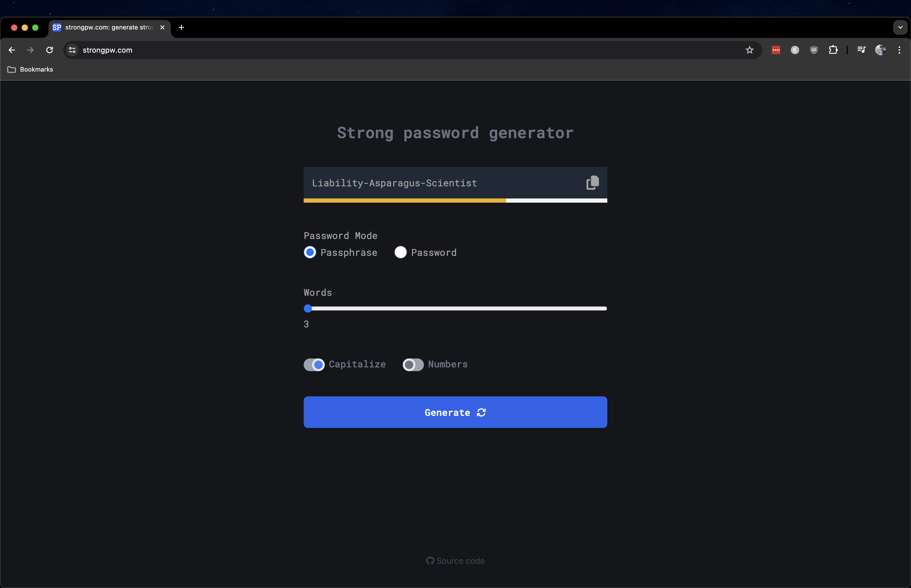

# strongpw.com

## Description

Built with React 18 and Vite.

Generates a strong password in the following modes:

- passphrase
  - 3 - 10 words
  - Capitalization and Numbers options
- password
  - 12 - 100 characters
  - Symbols and Numbers options

All code runs client side. No logging or analytics.

### Building code

- `npm i`
- `npm run build`

### Local Development

- `npm run dev`

### Testing

- `npm run test`
- `npm run test:coverage`

### Linting and Formatting Code with Autofix

- `npm run format`
